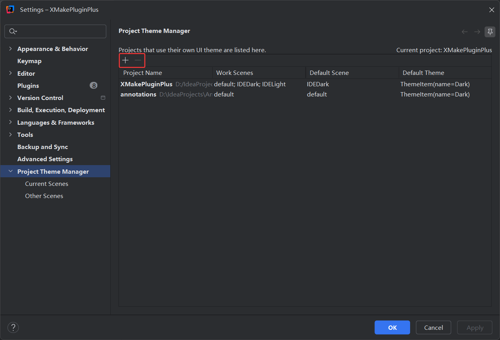
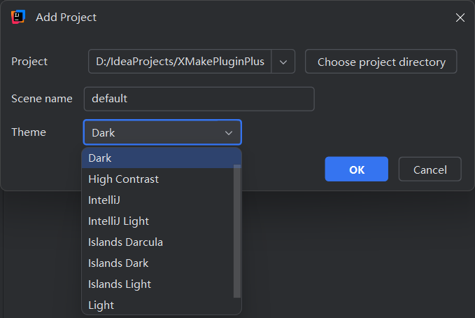
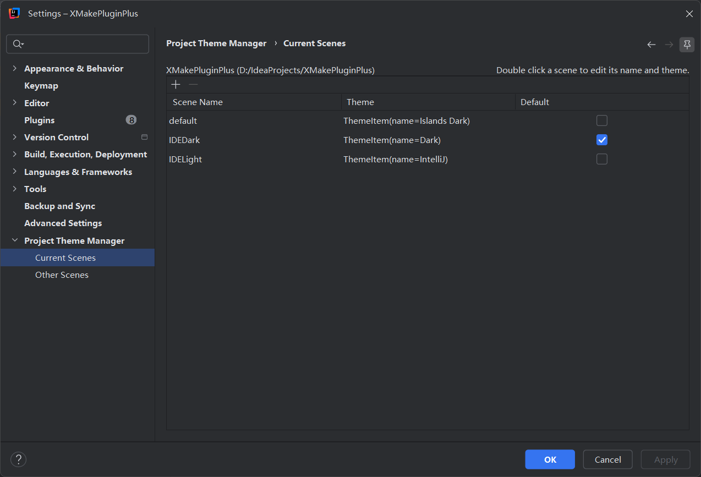
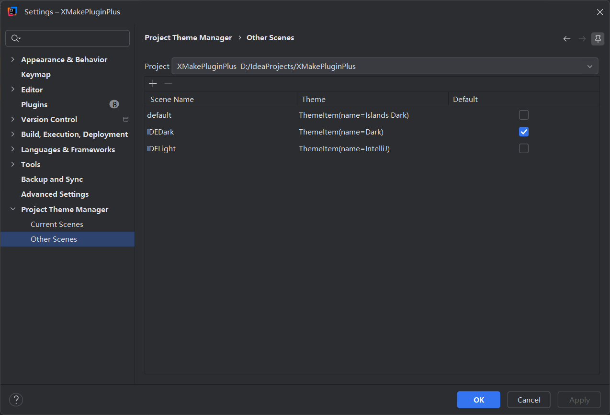
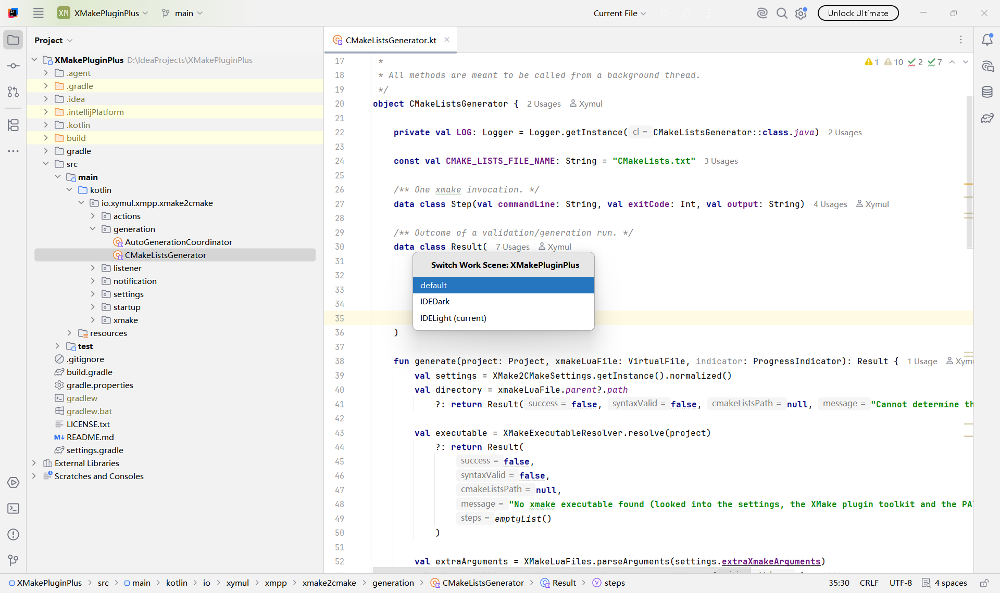

# Project Theme Manager

A IntelliJ IDEs plugin, user can register to remembers the UI theme of each project and applies it when the project opens.
And it provides a feature named `Work Scene` to quickly switch UI theme from registered(project level or <s>global level</s>) scenes.

The motivation behind this plugin is the need to switch themes in different scenarios.

For example, Most people probably prefer a dark theme when coding, but a light theme that's easy on the eyes when reading documentation.

Even though IntelliJ IDEs lets you quickly switch themes with shortcuts, but having to pinpoint which one you want among several themes each time is tedious

So this plugin binds the UI theme to the scene, you just need to register a scene for your project (which can be global in the future) and set the UI Theme for that scene.

When you need to switch themes, just press the shortcut key of this plugin, and you can quickly switch themes to suit your current situation.

**You can think of this plugin as a bookmark that’s an alias for a UI Theme.**

## License

This program is open-sourced under the license of MIT.

```
Copyright (c) 2026 Xymul

Permission is hereby granted, free of charge, to any person obtaining a copy of this software and associated documentation files (the “Software”), to deal in the Software without restriction, including without limitation the rights to use, copy, modify, merge, publish, distribute, sublicense, and/or sell copies of the Software, and to permit persons to whom the Software is furnished to do so, subject to the following conditions:

The above copyright notice and this permission notice shall be included in all copies or substantial portions of the Software.

THE SOFTWARE IS PROVIDED “AS IS”, WITHOUT WARRANTY OF ANY KIND, EXPRESS OR IMPLIED, INCLUDING BUT NOT LIMITED TO THE WARRANTIES OF MERCHANTABILITY, FITNESS FOR A PARTICULAR PURPOSE AND NONINFRINGEMENT. IN NO EVENT SHALL THE AUTHORS OR COPYRIGHT HOLDERS BE LIABLE FOR ANY CLAIM, DAMAGES OR OTHER LIABILITY, WHETHER IN AN ACTION OF CONTRACT, TORT OR OTHERWISE, ARISING FROM, OUT OF OR IN CONNECTION WITH THE SOFTWARE OR THE USE OR OTHER DEALINGS IN THE SOFTWARE.
```

## Usage

Open `File-Settings-Project Theme Manager`:



Click `+` to add a config of a project, set the default/primary added scene name and choose its theme:

Note:
- *Only valid IntelliJ project directory can be input*
- *The current project is pinned at top, see above*
- *The default filling text see below(current project path & `default` scene name)*



Click `-` to remove a config.

Click subpage `Current Scenes` to manage current project's scenes:



you can set default scene for opening the project, changes the name of scenes or bundled theme of a scene.  

*Note: when default scene is changed, your editor UI theme is defaulted to be updated. Future we will add an option to turn this default behavior on or off.*

Click subpage `Other Scenes` to manage other registered projects' scenes. 



You can use shortcut `CTRL+ALT+W` to quick switch current project's scenes:



## Build

Requirements:
- IntelliJ SDK >= 2026.2.3

First to **MODIFY** the `gradle.propreties`, and ensure your environment have IntelliJ IDEs:
```properties
# root directory of IDE which provides the sdk
localIdePath=$1

org.gradle.java.installations.paths=$2

org.gradle.java.home=$3
```

**OR** *modify* `build.gradle`:

Remove three items above in `gradle.properties` and this:
```groovy
def localIdePath = providers.gradleProperty('localIdePath').get()
```

then add this:
```groovy
dependencies {
    intellijPlatform {
        create(IntelliJPlatformType.IntellijIdeaCommunity, "2026.2.3")
    }
}
```

After you have modified build files, run this in terminal to build project:
```shell
./gradlew build
./gradlew buildPlugin
./gradlew --offline build
```

To test the effect of this plugin, run:
```shell
./gradlew runIde
```